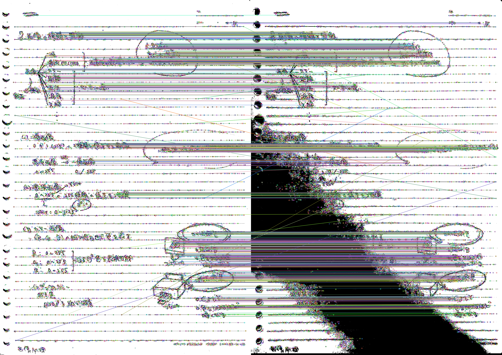
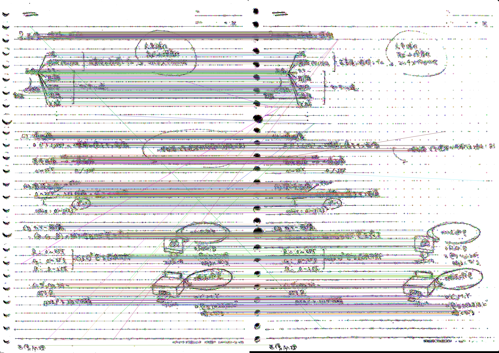

# deshade-doc
Remove shadow from hand-scanned documents image. My graduation researches at The Salesian Polytechnic.

## Usage

### Requirements

- Docker

### Run

1. Prepare and put target image(s) into `./img/`
    - images may hand-scanned documents.
    - if you want to evaluate the result, you also have to machine-scan your input, and put it with prefix `scanner_`
      - ex: `note01.jpg` and `scanner_note01.jpg`
1. Bootup docker, and bash
    - `./script/up.sh`

- Pattern1: `deshade-doc` only
  - `python src/source.py {img_name}`
  - ex: `python src/source.py note06.jpg`
  - relative path from `./img/`
- Pattern2: `deshade-doc` and `evaluate`
  - `python src/evaluate.py {img_name}`
  - not only `evaluate`. `deshade-doc` and `evaluate`.

### Result

#### `deshade-doc`

- `result/complete.png`: complete image. not thresholded.
- `result/lighted_up_shade.png`: last processed shade's crop image.
- `result/shade_cropped.png`: shade before processed.
- `result/thed.png`: input image just thresholded with `cv2.THRESH_OTSU`
- `result/thed_completed.png`: thresholded, and completed image.

### `deshade-doc` + `evaluate`

- `result/thed.png`, `result/thed_completed.png`: same above.
- `result/thed_scanned.png`: scanned image just thresholded with `cv2.THRESH_OTSU` for compare.
- `result/scanned-m-base.png`: comparing image via matching between `./result/thed_scanned.png` and `./result/thed_base.png`.
  - 
- `result/scanned-m-deshaded.png`: comparing image via matching between `./result/thed_scanned.png` and `./result/thed_completed.png`.
  - 
- `STDOUT`: matching distance as score. smaller is good(seems near with input image).
  - ex: `note01.jpg` (`scanner_note01.jpg` is already prepared.)
  - ```
      result:
      base: 22.65706051873199
      deshaded: 23.282574568288855
    ```
  - by the way, result above is bad :p

## Request, Question

Issue, mail is welcome.